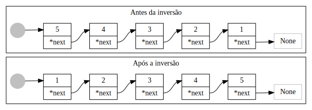

Escreva uma função chamada inverterLista que receba uma lista não ordenada na estrutura de nós (lista encadeada), onde esta deve inverter a ordem dos elementos dessa lista. Segue um exemplo de inversão de uma lista com 5 elementos:

